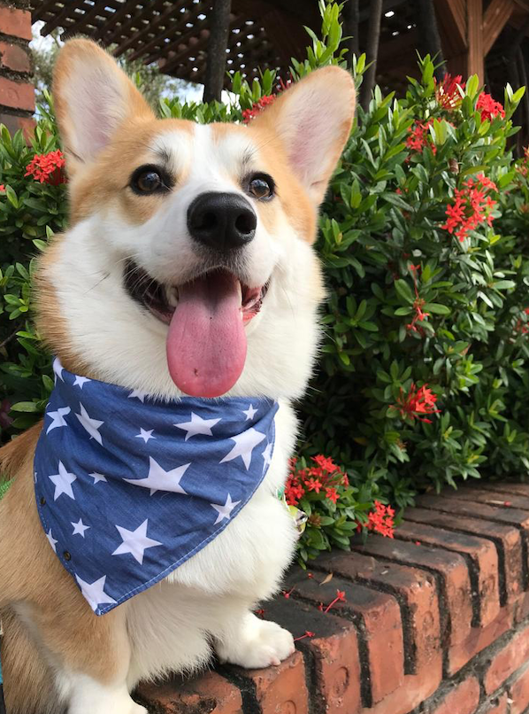
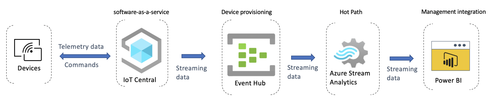
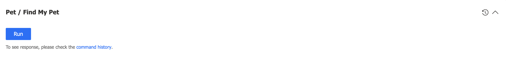
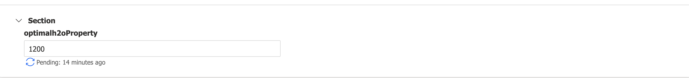
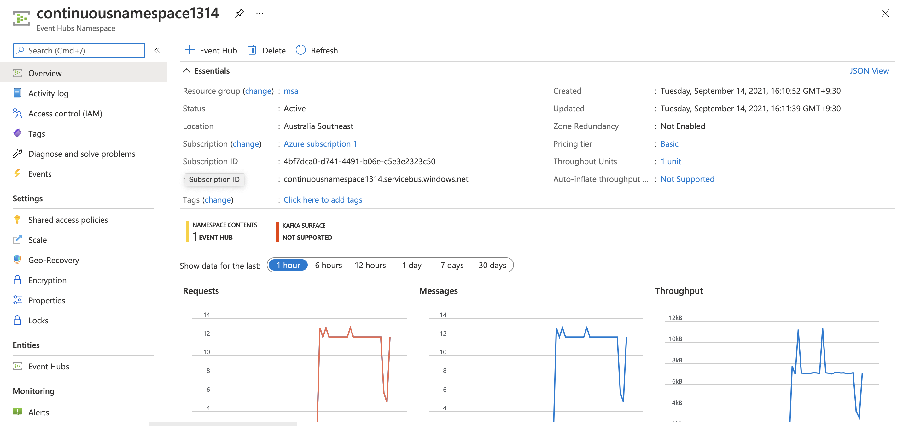
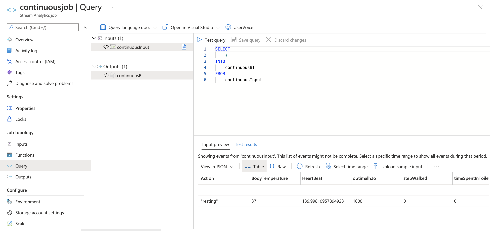
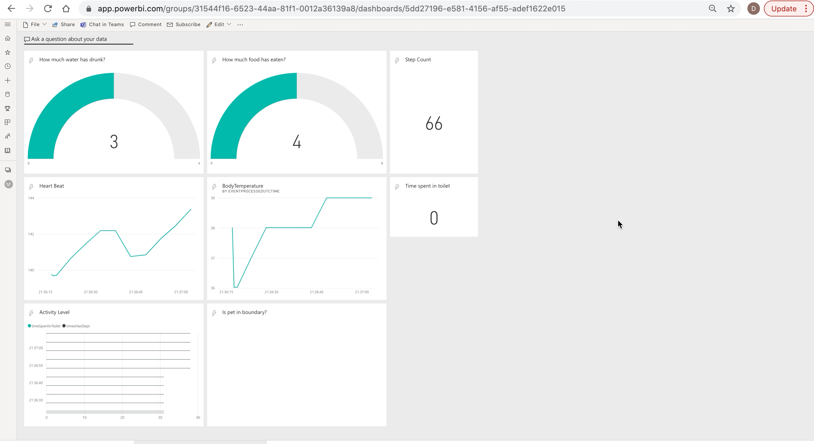

# MSA Iot Project
## _Pet Health Monitor_



This is Donut. He lives in University of Adelaide. Despite his cuteness he always sneaks around in the campus. University of Adelaide is a big university. Sometime his owner has trouble of finding him.

His owner has reached us to ask for a solution to deal with this. After going through the Azure Student Acceleration Bootcamp. Here we have a solution for that.

Iot Central application + Event Hut + Power BI = Pet Health Monitor

This Iot solution will allow you to

- Track your pet position
- Monitor your pet's health 

## Features

- Monitor heartbeat and body temperature.
- Set up optimal heartbeat and body temperature, the system will warn you if these metrics drop below optimal value.
- Track your pet activity level such sleeping time, how many steps has walked, and time spent in toilet.
- Track your pet diet habit, how many water and food has drunk and eaten.
- Constantly monitor your pet's geographic location.
- Monitor to your pet if he moved out of boundary, in this case is the University of Adelaide

## Architecture


Deivces
It is a electronic device that wearable on your pet that monitor his health and behaviors

IoT
Device will send telemetry data to the IoT Central which is a fully managed SaaS (software-as-a-service). This IoT Central abstract the technical choices and lets us focus on our solution exclusively.

Event Hub
IoT Hub Device Provisioning Service (DPS) is recommended for registering and connecting large sets of devices. DPS lets you assign and register devices to specific Azure IoT Hub endpoints at scale.

Azure Stream Analytics
Azure Stream Analytics is used for stream processing and rules evaluation. It is used to analysis hot path data. Hot path data must be analysed in real time and with low latency. Sudden drop of body temperature will cause serve damage to your pet. Hence we would like to stream the data with latency and closely monitor your pet.

Power BI Dashboard
Provide visualization of data such as in gauge, bar chart ...etc

## Stimulation
To better test our prototypes, we have create a script to stimulate pet behaviours. The script is located ./PetHealthMonitor/app.js

The script send the following telemetry data for every 5 seconds:
```
{
    Action: state, //Curent action
    BodyTemperature: parseInt(temp), // Body Temperature
    HeartBeat: heartbeat, //Heat Beat
    optimalh2o: optimalWater, //optimal amount of water
    stepWalked: steps, //total steps has taken
    timeSpentInToilet: timeIntoilet, // time spent in toilet
    waterHasDrunk: waterDrunk, // amount of water has drunk
    foodHasEaten: foodEaten, // amount of food has eaten
    timesHasSlept: timeSlept, // amount of time has slept
    PetInBoundary: isPetInBoundary, //true if pet is in the university else false
    isCallMyPet: findMyPet, // is the findMyPet function on
    Location: { // current location
      lon: currentLon,
      lat: currentLat,
    },
  }
```
```
var properties = {
    PetID: petIdentification, // Unqiue ID for identitifcation
    optimalh2oProperty: optimalWater, //Optimal water drunk
    boundary:currentBoundary, //Consist 2 points 
    };
```

In each literation, the action will either move randomly, eat, drink, go to toilet, sleep and rest.

If the action is "move randomly", the pet will move to a random place.

If the action is "eat", "drink" and "go to toilet", the pet will move to a food source, water source and toilet respectively.

If the action is "sleep" and "rest", the pet will stay at the same place.

The duration of the action is random. The body temperature and heart beat will increase or decrease respect to the action. To calculate the amount of food and water consumed, we measure the duration of the action. For example, if the pet stays at the water source for 5 seconds, we expect that the pet drinks 0.5 ml water.

## IoT Central Application
The overview of the application. The application will check if the pet is stay in the boundary.


Rules that define to monitor health. eg. if heartbeat drop below certain value.


Commands:
Find my pet is command that help you to find the pet. If it is triggered, we expect the device to make some noise.


This command is for setting the optimal amount of water drunk for the pet. 


## Event Hub
The setting for event hub.


## Azure Stream Analytics
The setting for Azure Stream Analytics.


## Power BI Dashboard

